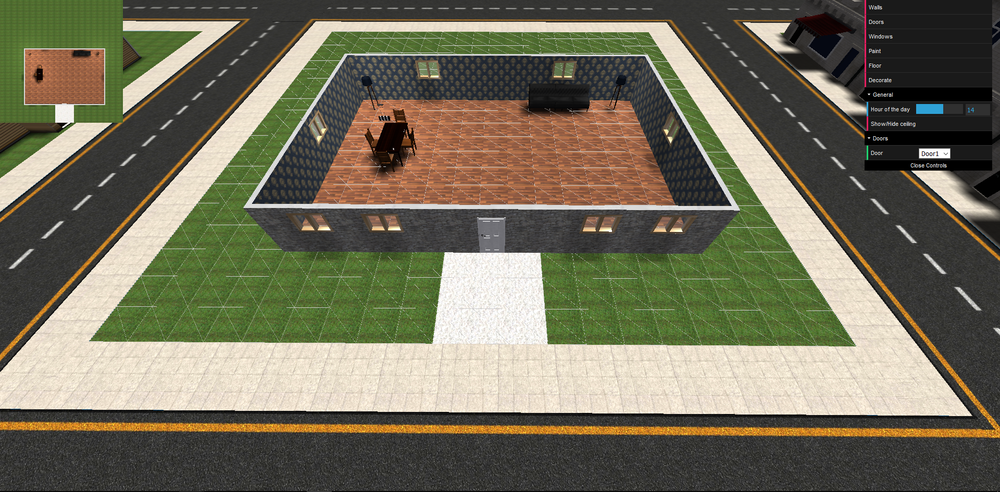

# House builder simulator
This is a house builder simulator developed with WebGL and threejs. It is just a graphical software to design and build your own house in a piece of terrain, similar to what can be done in the Sims.
<h2>Functionalities</h2>
In this app you can do the following actions:
- Build walls in your terrain.
- Place doors in those walls (2 models available)
- Place windows (1 model available)
- Paint the walls (8 textures available)
- Place different floors (10 textures available)
- Decorate your house with some furniture (5 models/pieces of furniture available).
- Show or hide an automatically calculated ceiling on the house.
- Change the hour of the day in order to see the house and its components with different levels of illumination.
<h2>Controls</h2>
To start building, click the left button of your mouse with "Walls" selected. Click again to confirm the wall you're building or left to cancel it.

To paint the walls or place the doors you can use the same controls. Left click to start painting/placing, left again to confirm or right to cancel.

To place doors, windows or furniture just left click on wherever you want to place it. Doors and windows won't show unless you're clicking on a wall. To rotate a piece of furniture you have to press "r" key on the keyboard.
<h2>Screenshots</h2>
```

```
<h2>To do</h2>
Some functionalities have few options, like the pieces of furniture available. A lot of new models could be added to enrich a lot this work.

Actions cannot be undone and the elements placed on the scene cannot be removed. A "destroy" action should be added.
<h2>Credits</h2>
I do not own any of the textures and models used in this project and I do not take any profit of them.

Unfortunately, this was an academic project and I did not write down the authors of these great works.

If anyone is able to recognize them, please open an issue or contact me and notify me so I am able to give proper credit to the authors.
